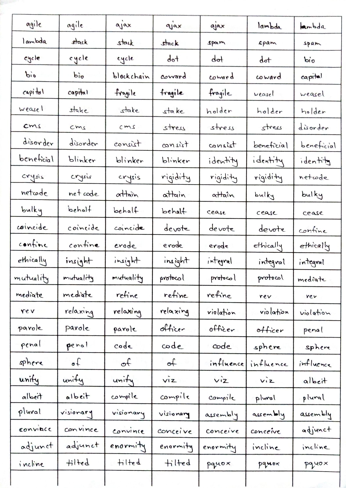

<h1 align="center">Handwritten Word Generation using GANs</h1>

<div align="center">
    
    
    
</div>

Unofficial PyTorch implementation of the following paper:

<blockquote>
<strong>Adversarial Generation of Handwritten Text Images Conditioned on Sequences</strong>

Eloi Alonso, Bastien Moysset, Ronaldo Messina

<a>https://arxiv.org/pdf/1903.00277.pdf</a>

<p><strong><em>Abstract</em></strong>: State-of-the-art offline handwriting text recognition systems tend to use neural networks and therefore require a large amount of annotated data to be trained. In order to partially satisfy this requirement, we propose a system based on Generative Adversarial Networks (GAN) to produce synthetic images of handwritten words. We use bidirectional LSTM recurrent layers to get an embedding of the word to be rendered, and we feed it to the generator network. We also modify the standard GAN by adding an auxiliary network for text recognition. The system is then trained with a balanced combination of an adversarial loss and a CTC loss. Together, these extensions to GAN enable to control the textual content of the generated word images. We obtain realistic images on both French and Arabic datasets, and we show that integrating these synthetic images into the existing training data of a text recognition system can slightly enhance its performance.</p>
</blockquote>

## Team members

- Ruchita Nagare [[LinkedIn]](https://www.linkedin.com/in/ruchita-nagare/)
- Amit Panthi [[Github]](https://github.com/amitpanthi) | [[LinkedIn]](https://www.linkedin.com/in/amit-panthi/)
- Sujay Rokade [[Github]](https://github.com/fractal2k) | [[LinkedIn]](https://www.linkedin.com/in/sujay-rokade/) | [[Twitter]](https://twitter.com/sujay_rokade)

## File structure

Path | Description
-----|------------
Handwriting-Synthesis| Main folder
├ src | Source folder
│ ├ `augment.py` | Differentiable augmentation module
│ ├ `box_extraction.py` | Script to extract images from data files
│ ├ `config.py` | Model hyperparameters and other constants
│ ├ ctoi.txt | Character to index mappings
│ ├ `dataset.py` | PyTorch dataset module for the model
│ ├ `inference.py` | Inference script
│ ├ itoc.txt | Index to character mappings
│ ├ `layers.py` | Module defining layers for the networks
│ ├ `lookahead.py` | Lookahead wrapper for Adam
│ ├ `losses.py` | Module defining all the loss metrics
│ ├ `models.py` | Module containing all the models
│ ├ `test_rec.py` | Recognizer testing script
│ ├ `train.py` | Training script for GAN
│ ├ `train_rec.py` | Training script for recognizer
│ ├ `utils.py` | Module containing utility functions

# Usage

*Disclaimer: We couldn't get the model to converge for some reason. I'm documenting everything here just in case someone else might need the code for this paper.*

## Installation

1. Download the repository.
2. Create a virtual environment in Python.
3. Run the following command:
```
pip install -r requirements.txt
```
This will install the dependencies and then you can use the code.

## Training

The model has 4 components. The first three take up ~13GB of memory and the fourth one takes up ~24GB.

The entire model was trained on 2 Quadro RTX 6000 GPUs (you might want to modify the devices in the training script to suit your needs).

The training script can be run using the following command:
```
python train.py -l <log name> -e <number of epochs>
```

The script creates training logs in a separate folder  `./src/runs/`, which you can visualize using tensorboard.

## Dataset

Instead of using RIMES and OpenHart datasets the authors have used, we tried to use an english dataset. To that end, we decided to create a custom dataset using [Sujay](https://github.com/fractal2k)'s handwriting.

A sample from the custom dataset looks like this:



All individual words are extracted using the `box_extraction.py` script using the following command:
```
python box_extraction.py <DATASET_DIRECTORY> <TARGET_DIRECTORY>
```

where <DATASET_DIRECTORY> is the directory containing all such grid file images (in `.jpg` format) and <TARGET_DIRECTORY> is the folder in which you need all the individual samples.

All individual words were then manually labelled, i.e. renamed in the format: `<word> (<sample number>).png`

For example: `parole (1).png`

(This naming convention can be modified in the `dataset.py` file where the images are read.)

We were able to collect 8539 samples before we decided to use the [IAM words dataset](https://fki.tic.heia-fr.ch/databases/iam-handwriting-database) as well.

## Inference

To run inference using the trained model, run the following command:
```
python inference.py -i <word>
```